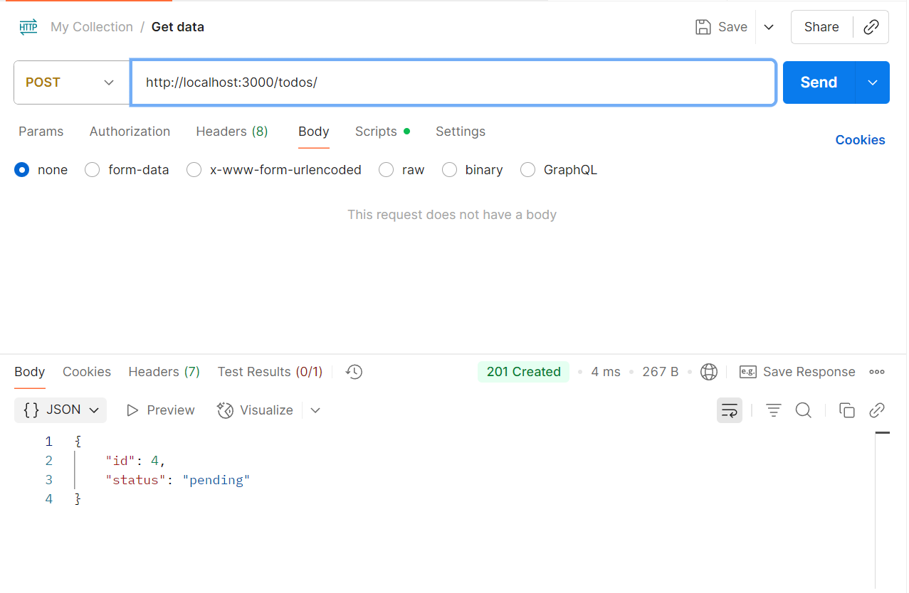
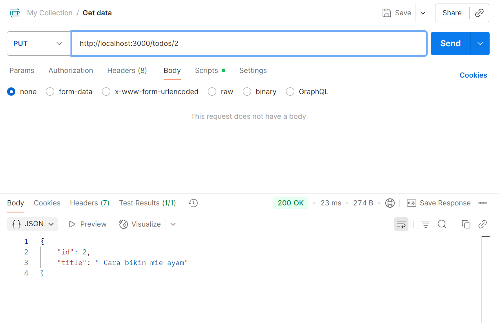
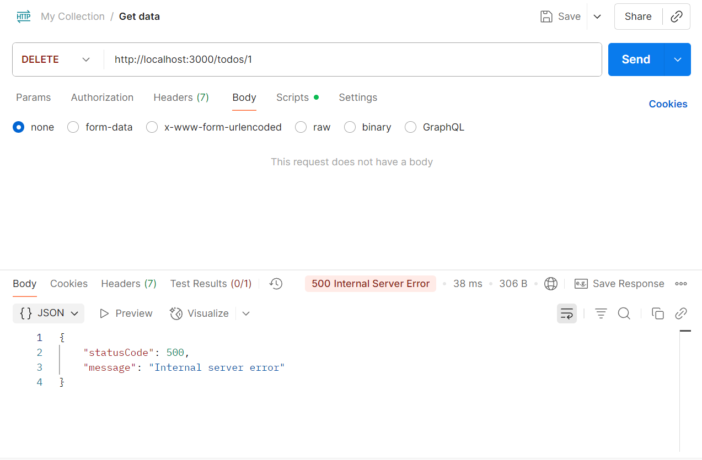

# 📋 Todo List API - NestJS

## 1) Identitas
- *Nama:* Kalilah Raihanna Rizky Arafah  
- *Kelas:* XI RPL 1  

---

## 2) Deskripsi Singkat API
API ini dibuat menggunakan *NestJS* tanpa database.  
Data Todo disimpan di dalam *array*.  
Fitur utama:
- Menambahkan todo
- Melihat semua todo
- Melihat todo berdasarkan ID
- Mengubah todo
- Menghapus todo  

---

## 3) Daftar Endpoint
| Method  | Endpoint        | Deskripsi                           |
|---------|------------------|-------------------------------------|
| GET     | /todos           | Menampilkan semua todo               |
| GET     | /todos/:id       | Menampilkan todo berdasarkan ID      |
| POST    | /todos           | Menambah todo baru                   |
| PUT     | /todos/:id       | Mengupdate todo berdasarkan ID        |
| DELETE  | /todos/:id       | Menghapus todo berdasarkan ID         |

---

## 4) Screenshot Hasil Uji Coba
*GET /todos*  


*POST /todos*  


*PUT /todos/:id*  


*DELETE /todos/:id*  


---

## 5) Cara Menjalankan
1. Clone repository  
   ```bash
   git clone <url-repo>
   cd project-nestjs